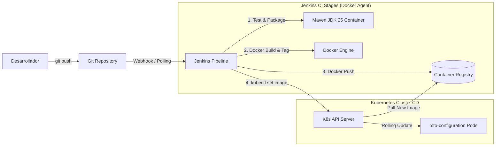

# Requirements

### Overview & Goals
El objetivo es implementar un pipeline de Integración Continua y Despliegue Continuo (CI/CD) automatizado con Jenkins para el microservicio `mto-configuration` (Java 25, Spring Boot 4.0.1, Maven), que compile, valide con tests, genere la imagen Docker optimizada, la publique en un registro de contenedores y despliegue la aplicación en un clúster de Kubernetes con estrategia de actualización sin interrupciones (*RollingUpdate*).

### Scope
- **In Scope**:
  - Creación de un `Jenkinsfile` declarativo multi-etapa ejecutado mediante agentes Docker.
  - Compilación y ejecución de la suite de pruebas unitarias/integración con Maven y JDK 25 dentro de contenedor.
  - Construcción y etiquetado de imagen Docker a partir del `Dockerfile` multi-stage existente.
  - Publicación de la imagen en el Container Registry (Docker Hub, Harbor, Nexus o ECR) gestionando credenciales de forma segura.
  - Creación de manifiestos Kubernetes (`Deployment`, `Service`, `ConfigMap`, `Secret`) para el despliegue del servicio.
  - Despliegue automatizado y verificación del estado del rollout (`kubectl rollout status`) en el clúster K8s.
  - Gestión de variables de entorno y conexión con dependencias de infraestructura (PostgreSQL, Redis, RabbitMQ, Keycloak).

- **Out of Scope**:
  - Instalación y administración de la infraestructura del propio clúster Kubernetes o servidor Jenkins (se asumen operativos).
  - Configuración de pipelines para proyectos satélite (como `mto-stock`).

### User Stories
- **Como desarrollador**, quiero que al hacer push a la rama principal se ejecuten automáticamente las pruebas y se construya el contenedor para asegurar la calidad del código.
- **Como operador/DevOps**, quiero que el nuevo artefacto se despliegue automáticamente en Kubernetes sin caída de servicio y con rollback en caso de fallo en el arranque.

### Functional Requirements
1. **Detección y compilación**: El pipeline debe ejecutarse automáticamente ante commits o de forma manual.
2. **Entorno reproducible**: La fase de compilación debe ejecutarse en un contenedor `maven:3.9.11-eclipse-temurin-25` garantizando paridad con Java 25.
3. **Control de versionado de imágenes**: Cada imagen Docker debe etiquetarse con el hash corto de Git (`${GIT_COMMIT[0..7]}`), el número de build de Jenkins (`${BUILD_NUMBER}`) y `latest` (en rama principal).
4. **Despliegue atómico**: El despliegue en Kubernetes debe actualizar la imagen del deployment y monitorizar `kubectl rollout status` hasta que los pods estén `Ready`.
5. **Gestión de fallos**: Si los tests fallan o la compilación no es exitosa, el pipeline debe abortarse de inmediato sin alterar el entorno de ejecución.

### Non-Functional Requirements
- **Seguridad**: No incluir credenciales, contraseñas o kubeconfigs en el código fuente; todo debe inyectarse a través del Credentials Store de Jenkins (`withCredentials` y `withKubeConfig`).
- **Resiliencia**: El despliegue debe utilizar sondas `livenessProbe` y `readinessProbe` de Spring Boot Actuator para evitar enrutar tráfico a pods no inicializados.

# Technical Design

### Current Implementation
El proyecto `mto-configuration` dispone de:
- `Dockerfile` multi-etapa que utiliza `maven:3.9.11-eclipse-temurin-25` para la construcción y `eclipse-temurin:25-jre` para la imagen final de producción, ejecutándose bajo un usuario no-root `spring`.
- `compose.yaml` local que levanta **solo la aplicación**. La infraestructura del servicio —PostgreSQL 17, Redis 7.4, RabbitMQ 4 y Keycloak 26.1 con autenticación OAuth2/JWT— vive desde la migración a [`mto-platform`](https://github.com/alexwarrior1991/mto-platform), el entorno local compartido del dominio, y ya no la levanta este repositorio.
- Configuración Maven basada en Java 25 y Spring Boot 4.0.1.

> **Nota posterior a la redacción de este plan.** El repositorio ya tiene CI real en **GitHub
> Actions** (`.github/workflows/ci.yml`): compila, ejecuta la suite y, al entrar en `master`,
> construye la imagen y la publica en **GHCR** (`ghcr.io/alexwarrior1991/mto-configuration`). Es
> decir, la parte de CI y de publicación de imagen que este documento propone **ya está resuelta por
> otro medio**.
>
> Este plan sigue **sin implementar**: no existe `Jenkinsfile` ni manifiestos de Kubernetes en el
> repositorio. Se conserva como propuesta de despliegue en K8s, que es lo que GitHub Actions no
> cubre hoy. Antes de retomarlo hay que decidir si Jenkins sustituye al CI actual o solo añade el
> despliegue por debajo, porque tal y como está redactado duplica etapas que ya existen.

### Key Decisions
1. **Pipeline Declarativo con Agentes Docker**: Ejecutar las etapas dentro de contenedores efímeros para no depender de herramientas instaladas en los nodos de Jenkins.
2. **Autenticación desacoplada**: Utilizar el plugin de Jenkins `kubernetes-cli` (`withKubeConfig`) para comunicarse con el clúster de forma segura.
3. **Versionado inmutable de artefactos**: Etiquetar las imágenes Docker con el identificador del commit Git y el build number para permitir trazabilidad y rollbacks inmediatos.
4. **Health Checks nativos**: Aprovechar los endpoints de Actuator (`/actuator/health/liveness` y `/actuator/health/readiness`) para las sondas de Kubernetes.

### Architecture Diagram


### Jenkins Pipeline Structure (Jenkinsfile)
El pipeline declarativo constará de las siguientes etapas principales:

```groovy
pipeline {
    agent any

    environment {
        REGISTRY = 'tu-registry.dominio.com' // o docker.io/tu-usuario
        IMAGE_NAME = 'mto-configuration'
        REGISTRY_CREDENTIALS_ID = 'docker-registry-credentials'
        KUBECONFIG_CREDENTIALS_ID = 'k8s-kubeconfig'
        K8S_NAMESPACE = 'mto'
        DEPLOYMENT_NAME = 'mto-configuration-api'
        IMAGE_TAG = "${env.BUILD_NUMBER}-${env.GIT_COMMIT.take(7)}"
    }

    stages {
        stage('Checkout') {
            steps {
                checkout scm
            }
        }

        stage('Test & Build JAR') {
            agent {
                docker {
                    image 'maven:3.9.11-eclipse-temurin-25'
                    args '-v /root/.m2:/root/.m2'
                }
            }
            steps {
                sh 'mvn -B clean verify'
            }
        }

        stage('Build & Push Docker Image') {
            steps {
                script {
                    docker.withRegistry("https://${REGISTRY}", "${REGISTRY_CREDENTIALS_ID}") {
                        def customImage = docker.build("${REGISTRY}/${IMAGE_NAME}:${IMAGE_TAG}", "-f Dockerfile .")
                        customImage.push()
                        if (env.BRANCH_NAME == 'main' || env.BRANCH_NAME == 'master') {
                            customImage.push('latest')
                        }
                    }
                }
            }
        }

        stage('Deploy to Kubernetes') {
            steps {
                withKubeConfig([credentialsId: "${KUBECONFIG_CREDENTIALS_ID}"]) {
                    sh """
                        kubectl apply -f k8s/configmap.yaml -n ${K8S_NAMESPACE}
                        kubectl apply -f k8s/deployment.yaml -n ${K8S_NAMESPACE}
                        kubectl apply -f k8s/service.yaml -n ${K8S_NAMESPACE}
                        kubectl set image deployment/${DEPLOYMENT_NAME} ${DEPLOYMENT_NAME}=${REGISTRY}/${IMAGE_NAME}:${IMAGE_TAG} -n ${K8S_NAMESPACE}
                        kubectl rollout status deployment/${DEPLOYMENT_NAME} -n ${K8S_NAMESPACE} --timeout=180s
                    """
                }
            }
        }
    }

    post {
        always {
            cleanWs()
        }
        failure {
            echo "El pipeline ha fallado en alguna de las fases."
        }
    }
}
```

### Kubernetes Deployment Specification
Estructura de manifiestos en `k8s/`:
- `k8s/deployment.yaml`:
  - 2 réplicas mínimas para alta disponibilidad.
  - Sondas `livenessProbe` y `readinessProbe` apuntando a `/actuator/health/liveness` y `/actuator/health/readiness`.
  - Inyección de variables de entorno desde `ConfigMap` (URLs de servicios, puertos) y `Secret` (contraseñas de BD, RabbitMQ, Keycloak).
- `k8s/service.yaml`:
  - Servicio tipo `ClusterIP` mapeando el puerto 8080.
- `k8s/configmap.yaml`:
  - Perfil activo (`SPRING_PROFILES_ACTIVE=docker,k8s`), URLs de Postgres, Redis, RabbitMQ e Issuer de Keycloak.

### File Structure
```text
mto-configuration/
├── Dockerfile
├── Jenkinsfile              # Pipeline CI/CD declarativo
├── k8s/                     # Manifiestos para Kubernetes
│   ├── configmap.yaml
│   ├── deployment.yaml
│   ├── service.yaml
│   └── secret.yaml.example
├── pom.xml
└── src/
```

### Risks & Mitigations
- **Tiempo de descarga de dependencias Maven en cada build**: Mitigado montando el volumen `/root/.m2` del host o usando un proxy Nexus de artefactos.
- **Fallos en arranque de pods en K8s tras despliegue**: Mitigado con `kubectl rollout status` que detiene el pipeline si las sondas de salud fallan, permitiendo rollback automático (`kubectl rollout undo`).

# Testing

### Validation Approach
La validación se realizará en dos niveles:
1. **Validación en Pipeline (CI)**: Verificación automática de la compilación, ejecución de tests unitarios y empaquetado del artefacto.
2. **Validación en Clúster (CD)**: Verificación del despliegue en Kubernetes comprobando el estado del rollout y la disponibilidad de los endpoints de salud.

### Key Scenarios
1. **Build y Test Exitosos**:
   - Maven ejecuta `mvn clean verify` dentro del contenedor con JDK 25.
   - Todos los tests pasan y se genera el JAR.
2. **Construcción y Publicación de Imagen**:
   - La imagen se crea con la etiqueta `${BUILD_NUMBER}-${GIT_COMMIT}` y se sube correctamente al registro autenticado.
3. **Despliegue y Rolling Update**:
   - `kubectl set image` actualiza el contenedor del deployment.
   - Los nuevos pods se levantan, superan las sondas de readiness/liveness, y los pods antiguos se destruyen sin pérdida de peticiones.
4. **Verificación de Health Check**:
   - Endpoint `http://<service-ip>:8080/actuator/health` responde estado `UP`.

### Edge Cases
- **Fallo en Tests Unitarios**: El pipeline debe fallar en la etapa `Test & Build JAR`, sin construir ni publicar ninguna imagen Docker.
- **Fallo de autenticación en Registry o K8s**: El pipeline debe abortarse mostrando un mensaje claro de credenciales inválidas.
- **Pod en estado `CrashLoopBackOff`**: `kubectl rollout status` excederá el timeout (`180s`) y el stage fallará impidiendo marcar el build como exitoso.

# Delivery Steps

###   Step 1: Crear manifiestos base de Kubernetes para mto-configuration
Los manifiestos de Kubernetes para mto-configuration están creados y listos en el repositorio.

- Crear el directorio `k8s/` con los manifiestos base.
- Definir `k8s/deployment.yaml` con límites de recursos, sondas de liveness/readiness (`/actuator/health/liveness` y `/actuator/health/readiness`), y variables de entorno acordes a Spring Boot (PostgreSQL, Redis, RabbitMQ, Keycloak).
- Definir `k8s/service.yaml` exponiendo el puerto 8080 del servicio.
- Definir `k8s/configmap.yaml` y plantilla `k8s/secret.yaml.example` para la parametrización de entornos.

###   Step 2: Definir el Jenkinsfile declarativo con ejecución sobre Docker
El archivo Jenkinsfile declarativo está definido con todas las etapas de integración y despliegue continuo.

- Crear el archivo `Jenkinsfile` en la raíz del proyecto.
- Configurar el stage de Checkout y preparación de variables de entorno (`IMAGE_TAG`, `REGISTRY`, etc.).
- Configurar el stage `Test & Build` ejecutándose en un contenedor Docker con `maven:3.9.11-eclipse-temurin-25`.
- Configurar el stage `Docker Build & Push` para construir la imagen multi-stage y publicarla en el Container Registry con credenciales de Jenkins.
- Configurar el stage `Deploy to K8s` usando `withKubeConfig` o `kubectl` para actualizar el despliegue (`kubectl set image` / `kubectl apply`) y verificar el estado con `kubectl rollout status`.
- Añadir sección `post` para limpieza de imágenes locales y reporte de estado.

###   Step 3: Configurar credenciales, herramientas y job en el servidor Jenkins
Jenkins tiene instalados los plugins necesarios, las credenciales registradas y el pipeline configurado.

- Instalar los plugins de Jenkins requeridos: *Docker Pipeline*, *Kubernetes CLI*, *Git*, *Pipeline: Stage View*.
- Crear las credenciales en Jenkins: ID `docker-registry-credentials` (usuario/token de Container Registry) e ID `k8s-kubeconfig` (archivo kubeconfig del clúster).
- Configurar un nuevo ítem en Jenkins de tipo **Pipeline** o **Multibranch Pipeline** apuntando al repositorio Git y al `Jenkinsfile`.

###   Step 4: Ejecutar y validar el pipeline de CI/CD de extremo a extremo
El pipeline se ejecuta con éxito, publicando la imagen y desplegando el pod en el clúster K8s.

- Ejecutar un build manual (`Build Now`) o disparar mediante webhook de Git.
- Validar la ejecución correcta de los tests unitarios en el agente Docker.
- Verificar la publicación de la imagen en el Container Registry.
- Comprobar que los pods en Kubernetes se actualizan sin caídas (`Zero-downtime RollingUpdate`) y responden a las sondas de salud.